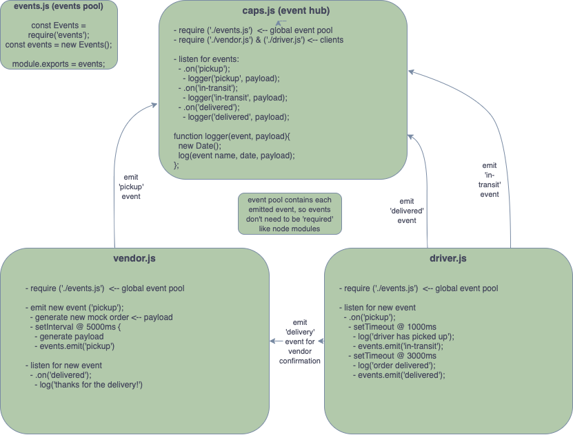

[ANOTHER README EXAMPLE HERE](https://github.com/codefellows/seattle-javascript-401n17/blob/master/reference/submission-instructions/labs/example/README.md)

# LAB - Class 16

## Project: Code Academy Parcel Service - CAPS

### Author: Joe Pennock

### Links and Resources

- [GitHub Repository](https://github.com/joepennock-401-advanced-javascript/caps)
- [GitHub PR]()
- [ci/cd](https://github.com/joepennock-401-advanced-javascript/caps/actions)
<!-- - [back-end server url](http://xyz.com) (when applicable) -->
<!-- - [front-end application](http://xyz.com) (when applicable) -->

## Setup

This project is run on the `Node.js` framework, using may of the built in `event` objects native to the `Node.js` runtime. To initialize this as an `npm` project, allowing for the use of `node modules`, run this command:
```
npm init -y
```
To properly run this application, you will need the `faker` library to mock vendor data which is used as the primary payload for all events.

To install `faker.js`:
```
npm i faker
```


### Environmental variables, or `.env` requirements (where applicable)

No `.env` used in CAPS - phase 1.

#### How to initialize/run your application (where applicable)

To run this application after all dependencies have been installed, start the event engine by running the command:
```
node caps.js || nodemon caps.js || npm start
```
This will start the initial event to fire off at 5 second intervals so long as the application is running.

### How to use your library (where applicable)

A utility library is being utilized to make reading the console output easier. This library is called 'chalk.js`. To install it, simply run:
```
npm i chalk
```

### Tests

Tests for this application are handled with the `jest` testing library. To run tests on this application, install `jest` to the dev dependencies. Do this by running the command:
```
npm i --save-dev jest
```
Once jest is installed, simply run the command:
```
npm test proof-of-life.test.js
```
and this will run all tests within the test file. Alternatively, you can run the command:
```
npm run watch
```
to start up the node daemon for tests. This can be useful when writing tests as it will act like `nodemon` and restart each time the file is saved, preventing the need of typing the test command each time a test needs to be run.

As of this point, tests are only running to as a proof of life for the `jest` library.

### UML

UML rough draft:


UML final - phase 1:

